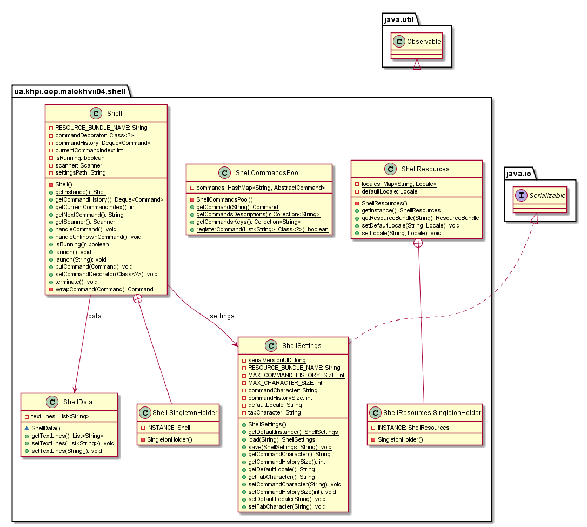

# №4 Тема: Інтерактивні консольні програми для платформи Java SE.<br/>Мета: Розробка інтерактивних консольних програм мовою Java. Реалізація діалогового режиму роботи з користувачем в консольних програмах.

# 1 Індивідуальне завдання

## 1.1 Розробник

Студент Малохвій Едуард Едуардович, КІТ-26А, Варіант 8 (Завдання №8).

## 1.2 Вимоги

1. Використовуючи програму рішення завдання лабораторної роботи №3, відповідно до прикладної задачі забезпечити обробку команд користувача у вигляді текстового меню:  
    - введення даних;
    - перегляд даних;
    - виконання обчислень;
    - відображення результату;
    - завершення програми і т.д.
    
2. Забезпечити обробку параметрів командного рядка для визначення режиму роботи програми: ?параметр "-h" чи "-help":
    - відображається інформація про автора програми, призначення (індивідуальне завдання), детальний опис режимів роботи (пунктів меню та параметрів командного рядка);
    - параметр "-d" чи "-debug": в процесі роботи програми відображаються додаткові дані, що полегшують налагодження та перевірку працездатності програми: діагностичні повідомлення, проміжні значення змінних, значення тимчасових змінних та ін.

## 1.3 Завдання

Ввести текст. У тексті знайти всі пари слів, з яких одне є обігом (словом навпаки) іншого (наприклад: "abc"-"cba", "def"-"fed"). Результат вивести у вигляді таблиці.

# 2 Розробка програми

## 2.1 Засоби ООП

Під час вирішенн поставленної задачі було використано паттерн Command для інкапсуляції операцій під виглядом команд та патер Decorator для розширення функціоналу команд для надання їм властивостей виведення детальної інформації для подальшої відладки. Для більш гнучкішої реалізації фабрики команд використано рефлексію.

## 2.2 Ієрархія та структура класів

Проект містить наступні пакети:
- shell - містить інтерактивну оболонку та її допоміжні класи.
- сommands - містить у собі перелік базових команд.
- commands.debug - містить у собі перелік команд, для відлагодження.
- commands.text - містить у собі перелік команд для обробки текстових даних, введення, виведення тощо.

<p align="center">
  <br/>
    Рис. 1 - Діаграма класів із пакету shell
</p>

<p align="center">
    
    Рис. 2 - Діаграма класів із пакету commands
</p>

<p align="center">
    <br/>
    Рис. 3 - Діаграма класів із пакету debug
</p>

<p align="center">
    <br/>
    Рис. 4 - Діаграма класів із пакету text
</p>

## 2.3 Опис програми

Згідно завдання реалізовано обробку параметрів отриманих через командний рядок, реалізовано довідку для усіх команд, реалізовано необхідний перелік команд.

## 2.4 Важливі фрагменти програми

Нижче наведено фрагмент точки входу програми.

```
package ua.khpi.oop.malokhvii04;

import java.io.File;
import java.io.IOException;
import java.net.URISyntaxException;

import ua.khpi.oop.malokhvii03.text.AnanymsCollection;
import ua.khpi.oop.malokhvii03.text.WordsCollection;
import ua.khpi.oop.malokhvii04.shell.CommandLineParser;
import ua.khpi.oop.malokhvii04.shell.Shell;
import ua.khpi.oop.malokhvii04.shell.ShellData;
import ua.khpi.oop.malokhvii04.shell.command.Command;
import ua.khpi.oop.malokhvii04.shell.command.CommandFactory;

public final class Application {

    public static void main(final String[] args) throws IOException {
        WordsCollection wordsCollection = new WordsCollection();
        AnanymsCollection ananymsCollection = new AnanymsCollection();

        ShellData shellData = ShellData.getBuilder()
                .setWordsCollection(wordsCollection)
                .setAnanymsCollection(ananymsCollection)
                .setCommandHistorySize(
                        CommandLineParser.parseCommandHistorySize(args))
                .setCommandCharacter(
                        CommandLineParser.parseCommandCharacter(args))
                .setTabCharacter(CommandLineParser.parseTabCharacter(args))
                .setInputStream(System.in).build();

        Shell shell = new Shell(shellData);
        shell.launch();

        for (Command command : CommandLineParser.parseCommands(args,
                shellData)) {
            shell.putCommand(command);
            shell.handleCommand();
        }

        while (shell.isRunning()) {
            Command command = CommandFactory.getCommand(shell.getNextCommand(),
                    shell.getShellData());
            if (command != null) {
                shell.putCommand(command);
                shell.handleCommand();
            } else {
                shell.handleUnknownCommand();
            }
        }
        shell.terminate();
    }

    public static String getApplicationName() {
        File file = null;
        try {
            file = new File(Application.class.getProtectionDomain()
                    .getCodeSource().getLocation().toURI());
        } catch (URISyntaxException exception) {

        }
        return file.getName();
    }
}

```

# 3 Результати роботи

Нижче наведено виведення обчислень у вигляді інтерактивної консолі.

<p align="center">
    
    Рис. 5 - Фрагмент демонстраційної програми
</p>

<p align="center">
    
    Рис. 6 - Фрагмент демонстраційної програми
</p>

<p align="center">
    
    Рис. 7 - Фрагмент демонстраційної програми
</p>

<p align="center">
    
    Рис. 8 - Фрагмент демонстраційної програми
</p>
  
<p align="center">
    
    Рис. 9 - Фрагмент демонстраційної програми
</p>

# Висновки

У ході виконання лабораторної роботи були покращені навички розробки інтерактивних консольних програм мовою Java. Реалізовано діалоговий режим роботи з користувачем в консольній програмі.