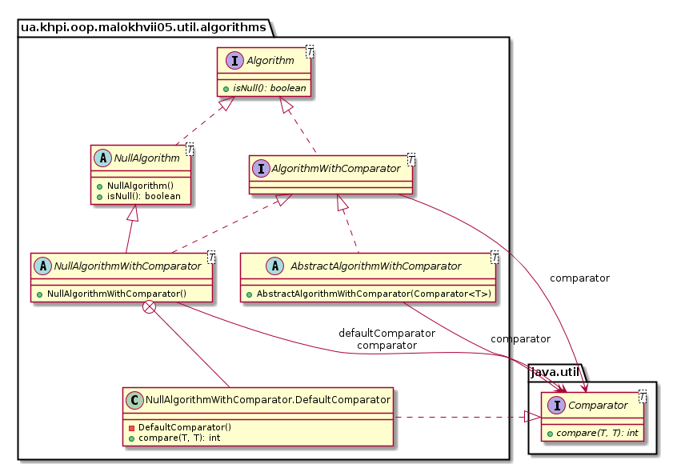
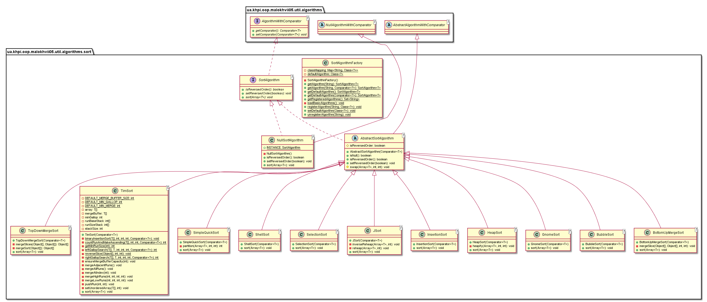
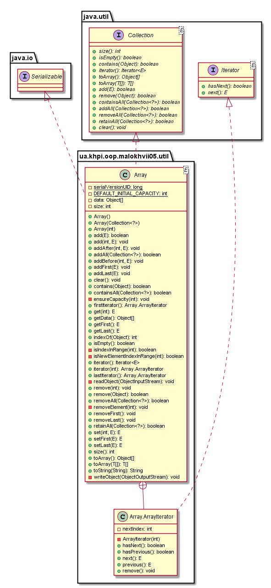
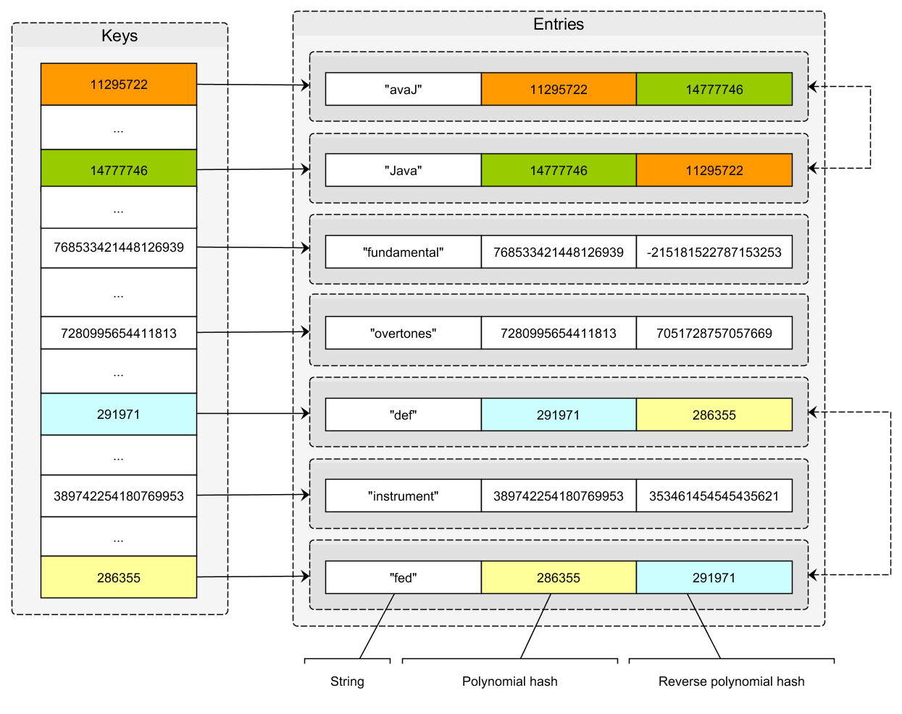
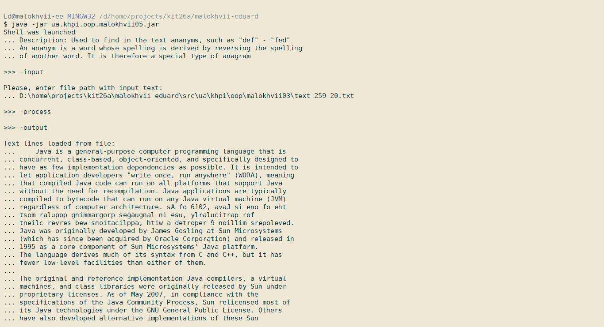
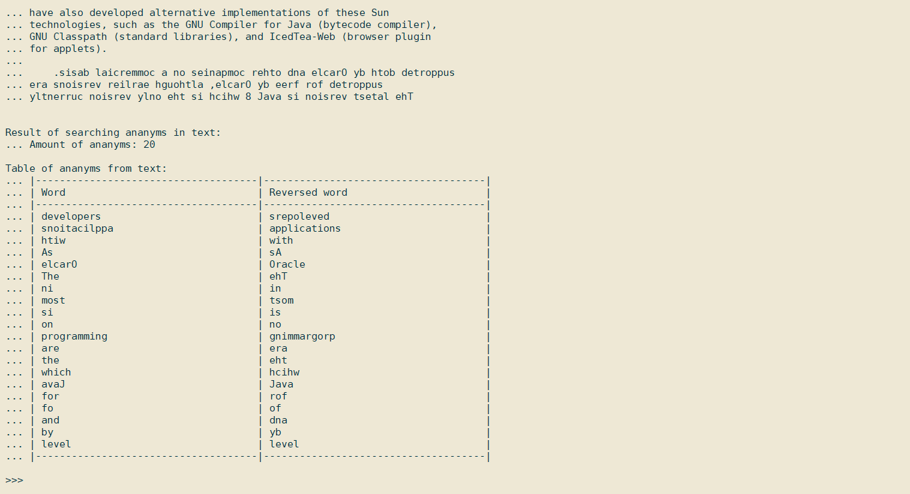

# №5 Тема: Розробка власних контейнерів. Ітератори<br/>Мета: Набуття навичок розробки власних контейнерів. Використання ітераторів.

# 1 Індивідуальне завдання

## 1.1 Розробник

Студент Малохвій Едуард Едуардович, КІТ-26А, Варіант 8.

## 1.2 Вимоги

1. Розробити клас-контейнер, що [ітерується](http://docs.oracle.com/javase/8/docs/api/java/lang/Iterable.html) для збереження початкових даних завдання [л.р. №3] у вигляді **масиву рядків** з можливістю додавання, видалення і зміни елементів.

2. В контейнері реалізувати та продемонструвати наступні методи:
    - `String toString()` повертає вміст контейнера у вигляді рядка;
    - `void add(String string)` додає вказаний елемент до кінця контейнеру;
    - `void clear()` видаляє всі елементи з контейнеру;
    - `boolean remove(String string)` видаляє перший випадок вказаного елемента з контейнера;
    - `Object[] toArray()` повертає масив, що містить всі елементи у контейнері;
    - `int size()` повертає кількість елементів у контейнері;
    - `boolean contains(String string)` повертає `true`, якщо контейнер містить вказаний елемент;
    - `boolean containsAll(Container container)` повертає `true`, якщо контейнер містить всі елементи з зазначеного у параметрах;
    - `public Iterator<String> iterator()` повертає ітератор відповідно до [Interface Iterable](http://docs.oracle.com/javase/8/docs/api/java/lang/Iterable.html).

3. В класі ітератора відповідно до [Interface Iterator](http://docs.oracle.com/javase/8/docs/api/java/util/Iterator.html) реалізувати методи:
    - `public boolean hasNext()`;
    - `public String next()`;
    - `public void remove()`.

4. Продемонструвати роботу ітератора за допомогою циклів *while* и *for each*.

5. Забороняється використання контейнерів (колекцій) і алгоритмів з [Java Collections Framework](https://docs.oracle.com/javase/8/docs/technotes/guides/collections/).

## 1.3 Завдання

Ввести текст. У тексті знайти всі пари слів, з яких одне є обігом (словом навпаки) іншого (наприклад: "abc"-"cba", "def"-"fed"). Результат вивести у вигляді таблиці.

# 2 Розробка програми

## 2.1 Засоби ООП

Під час вирішення поставленої задачі, було розроблено особисту колекцію та ітератор для забезпечення зручнішого та більш загального доступа до елементів колекції. Було реалізовано інтерфейси Iterable та Iterator.

## 2.2 Ієрархія та структура класів

Проект містить наступні пакети:
- util - містить реалізацію особистої колекції
- algorithms - містить реалізацію загальних алгоритмів для розробленої колекції
- algorithms.sort - містить алгоритми сортування особистої колекції
- algorithms.search - містить алгоритми пошуку за ключем в особистій колекції

<p align="center">
    <br/>
    Рис. 1 - Діаграма класів із пакету algorithms
</p>

<p align="center">
    <br/>
    Рис. 2 - Діаграма класів із пакету sort
</p>

<p align="center">
    <br/>
    Рис. 3 - Діаграма класів із пакету search
</p>

<p align="center">
    <br/>
    Рис. 4 - Діаграма класів із пакету util
</p>

## 2.3 Опис програми

Модифіковано реалізацію інтерактивної консолі із лабораторної роботи №4, для повторного використання у наступних завданнях. Модифіковано алгоритм пошуку ананимів на основі поліноміального хешу, таким чином зменьшено просторова та часову складність алгоритму пошуку.

<p align="center">
    
    Рис. 5 - Схематичне пояснення модифікованого алгоритму пошуку
</p>

## 2.4 Важливі фрагменти програми

Нижче наведено реалізації розробленого контейнеру.

```
package ua.khpi.oop.malokhvii05.util;

import java.util.Collection;
import java.util.Iterator;
import java.util.NoSuchElementException;

import sun.reflect.generics.reflectiveObjects.NotImplementedException;
import ua.khpi.oop.malokhvii05.util.algorithms.search.SearchAlgorithm;

public final class Array<E> implements Collection<E> {

    public final class ArrayIterator implements Iterator<E> {

        private int nextIndex;

        private ArrayIterator(final int nextIndex) {
            this.nextIndex = nextIndex;
        }

        @Override
        public boolean hasNext() {
            return nextIndex != size;
        }

        public boolean hasPrevious() {
            return nextIndex != 0;
        }

        @SuppressWarnings("unchecked")
        @Override
        public E next() {
            if (nextIndex == size) {
                throw new NoSuchElementException();
            }

            int currentIndex = nextIndex;
            nextIndex++;
            return (E) Array.this.data[currentIndex];
        }

        @SuppressWarnings("unchecked")
        public E previous() {
            int currentIndex = nextIndex - 1;
            if (currentIndex < 0) {
                throw new NoSuchElementException();
            }

            nextIndex = currentIndex;
            return (E) Array.this.data[currentIndex];
        }

        @Override
        public void remove() {
            if (size == 0) {
                return;
            }

            Array.this.removeElement(nextIndex);
        }
    }

    private static final int DEFAULT_INITIAL_CAPACITY = 16;
    private Object[] data;
    private int size;

    public Array() {
        this(DEFAULT_INITIAL_CAPACITY);
    }

    public Array(final Collection<? extends E> collection) {
        addAll(collection);
    }

    public Array(final int capacity) {
        data = new Object[capacity];
    }

    @Override
    public boolean add(final E element) {
        addLast(element);
        return true;
    }

    public void addLast(final E element) {
        ensureCapacity(size + 1);
        data[size++] = element;
    }

    @Override
    public void clear() {
        int index;
        for (index = 0; index < size; index++) {
            data[index] = null;
        }
        size = 0;
    }

    @Override
    public boolean contains(final Object object) {
        return indexOf(object) != -1;
    }

    public int indexOf(final Object object) {
        int index;
        if (object == null) {
            for (index = 0; index < size; index++) {
                if (data[index] == null) {
                    return index;
                }
            }
        } else {
            for (index = 0; index < size; index++) {
                if (data[index].equals(object)) {
                    return index;
                }
            }
        }
        return SearchAlgorithm.INDEX_NOT_FOUND;
    }

    @Override
    public boolean isEmpty() {
        return this.size == 0;
    }

    public ArrayIterator firstIterator() {
        return iterator(0);
    }

    @Override
    public Iterator<E> iterator() {
        return firstIterator();
    }

    public ArrayIterator iterator(final int index) {
        isIndexInRange(index);
        return new ArrayIterator(index);
    }

    @Override
    public boolean remove(final Object object) {
        int index;
        if (object == null) {
            for (index = 0; index < size; index++) {
                if (data[index] == null) {
                    removeElement(index);
                    return true;
                }
            }
        } else {
            for (index = 0; index < size; index++) {
                if (data[index].equals(object)) {
                    removeElement(index);
                    return true;
                }
            }
        }
        return false;
    }

    private void removeElement(final int index) {
        int amountOfMovedElements = size - index - 1;
        if (amountOfMovedElements > 0) {
            System.arraycopy(data, index + 1, data, index,
                    amountOfMovedElements);
        }

        data[--size] = null;
    }

    @Override
    public int size() {
        return this.size;
    }

    @Override
    public Object[] toArray() {
        Object[] array = new Object[size];
        System.arraycopy(data, 0, array, 0, size);
        return array;
    }

    @Override
    public String toString() {
        return toString("\n");
    }

    public String toString(final String separator) {
        StringBuilder stringBuilder = new StringBuilder();

        int index = 0;
        while (index < size) {
            stringBuilder.append(data[index].toString());
            stringBuilder.append(separator);
            index++;
        }

        return stringBuilder.toString();
    }
}
```

# 3 Результати роботи

Нижче наведено виведення обчислень у вигляді інтерактивної консолі.

<p align="center">
    
    Рис. 6 - Фрагмент демонстраційної програми
</p>

<p align="center">
    
    Рис. 7 - Фрагмент демонстраційної програми
</p>

# Висновки

У ході виконання лабораторної роботи були покращені навички розробки власних колекцій, досліджено реалізацію [Java Collections Framework](https://docs.oracle.com/javase/8/docs/technotes/guides/collections/), опановано використання ітераторів.