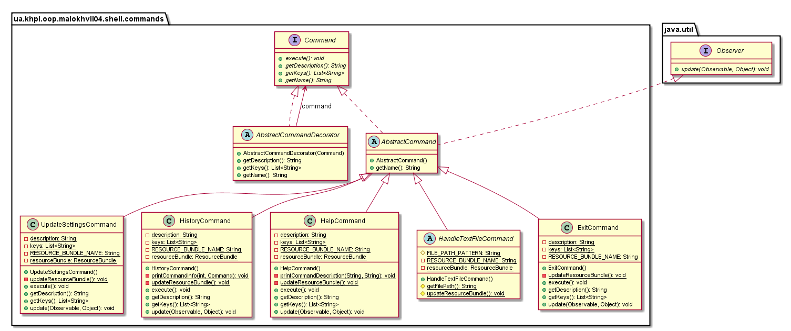
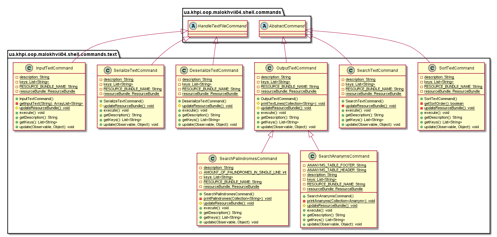

# №6 Тема: Серіалізація/десеріалізація об'єктів. Бібліотека класів користувача<br/>Мета: Тривале зберігання та відновлення стану об'єктів. Ознайомлення з принципами серіалізації/десеріалізації об'єктів. Використання бібліотек класів користувача.

# 1 Індивідуальне завдання

## 1.1 Розробник

Студент Малохвій Едуард Едуардович, КІТ-26А, Варіант 8.

## 1.2 Вимоги

1. Реалізувати і продемонструвати тривале зберігання/відновлення [раніше розробленого контейнера](https://oop-khpi.github.io/#task_05) за допомогою [серіалізації/десеріалізації](https://docs.oracle.com/javase/8/docs/technotes/guides/serialization/index.html).

2. Обмінятися відкомпільованим (без початкового коду) службовим класом (Utility Class) рішення задачі [л.р. №3](https://oop-khpi.github.io/#task_03_app) з іншим студентом (визначає викладач).

3. Продемонструвати послідовну та вибіркову обробку елементів розробленого контейнера за допомогою власного і отриманого за обміном службового класу.

4. Реалізувати та продемонструвати порівняння, сортування та пошук елементів у контейнері.

5. Розробити консольну програму та забезпечити діалоговий режим роботи з користувачем для демонстрації та тестування рішення.

## 1.3 Завдання

   Обмінятися відкомпільованим (без початкового коду) службовим класом з іншим студентом. Продемонструвати послідовну та вибіркову обробку елементів розробленого контейнера за допомогою власного і отриманого за обміном службового класу. Продемонструвати сортування та пошук елементів у контейнері. Забезпечити діалоговий режим роботи з користувачем для демонстрації та тестування рішення.

# 2 Розробка програми

## 2.1 Засоби ООП

Для реалізації поставлених завдань було розширено перелік команд із пакету text, для забезпечення серіалізації/десеріалізації, сортування, пошуку та обробки вхідного тексту. Для реалізації команд обробки тексту згідно завдань до лабораторної роботи №3, розширено та часткового модифіковано функціонал класу OutputTextCommand. 

## 2.2 Ієрархія та структура класів

Проект використовує наступні пакети із рішення до лабораторної роботи №4:
- shell - містить інтерактивну оболонку та її допоміжні класи.
- сommands - містить у собі перелік базових команд.
- commands.debug - містить у собі перелік команд, для відлагодження.
- commands.text - містить у собі перелік команд для обробки текстових даних, введення, виведення тощо.


<p align="center">
  <br/>
    Рис. 1 - Діаграма класів із пакету shell
</p>

<p align="center">
    
    Рис. 2 - Діаграма класів із пакету commands
</p>

<p align="center">
    <br/>
    Рис. 3 - Діаграма класів із пакету debug
</p>

<p align="center">
    <br/>
    Рис. 4 - Діаграма класів із пакету text
</p>

Проект використовує наступні пакети із рішення до лабораторної роботи №5:
- util - містить реалізацію особистої колекції
- algorithms - містить реалізацію загальних алгоритмів для розробленої колекції
- algorithms.sort - містить алгоритми сортування особистої колекції
- algorithms.search - містить алгоритми пошуку за ключем в особистій колекції

<p align="center">
    <br/>
    Рис. 5 - Діаграма класів із пакету algorithms
</p>

<p align="center">
    <br/>
    Рис. 6 - Діаграма класів із пакету sort
</p>

<p align="center">
    <br/>
    Рис. 7 - Діаграма класів із пакету search
</p>

<p align="center">
    <br/>
    Рис. 8 - Діаграма класів із пакету util
</p>


## 2.3 Опис програми

Згідно завдання реалізовано серіалізацію/десеріалізацію. Додано вирішення до завдання №15 із лабораторної роботи №3. Реалізовано налаштування інтерактивної оболонки. Вдосконалено збереження рядків, для відображення на інтерактивній консолі.

## 2.4 Важливі фрагменти програми

Нижче наведено фрагмент точки входу програми.

```
package ua.khpi.oop.malokhvii04;

import java.io.File;
import java.io.IOException;
import java.net.URISyntaxException;
import java.util.Locale;
import java.util.Set;

import org.reflections.Reflections;

import ua.khpi.oop.malokhvii04.shell.Shell;
import ua.khpi.oop.malokhvii04.shell.ShellCommandsPool;
import ua.khpi.oop.malokhvii04.shell.ShellResources;
import ua.khpi.oop.malokhvii04.shell.commands.AbstractCommand;
import ua.khpi.oop.malokhvii04.shell.commands.Command;

public final class Application {

    private static final String DEFAULT_LOCALE = "en";

    private static final String[] LOCALES = { Application.DEFAULT_LOCALE };


    private static final String BASE_PACKAGE = "ua.khpi.oop.malokhvii04."
            + "shell.commands";

    public static String getApplicationName() {
        File file = null;
        try {
            file = new File(Application.class.getProtectionDomain()
                    .getCodeSource().getLocation().toURI());
        } catch (final URISyntaxException exception) {

        }
        return file.getName();
    }
    
    public static void main(final String[] args) throws IOException {
        Application.setLocales();

        final Shell shell = Shell.getInstance();
        shell.launch();

        final Reflections reflections = new Reflections(
                Application.BASE_PACKAGE);

        final Set<Class<? extends AbstractCommand>> subTypes = reflections
                .getSubTypesOf(AbstractCommand.class);
        for (final Class<? extends AbstractCommand> subTypeClass : subTypes) {
            try {
                Class.forName(subTypeClass.getCanonicalName());
            } catch (final ClassNotFoundException exception) {

            }
        }

        Command command = null;
        if (args.length != 0 && shell.isRunning()) {
            for (final String key : args) {
                command = ShellCommandsPool.getCommand(key);
                if (command != null) {
                    shell.putCommand(command);
                    shell.handleCommand();
                }
            }
        }

        while (shell.isRunning()) {
            command = ShellCommandsPool.getCommand(shell.getNextCommand());
            if (command != null) {
                shell.putCommand(command);
                shell.handleCommand();
            } else {
                shell.handleUnknownCommand();
            }
        }
    }

    private static void setLocales() {
        final ShellResources shellResources = ShellResources.getInstance();
        for (final String locale : Application.LOCALES) {
            shellResources.setLocale(locale, new Locale(locale));
        }
        shellResources.setDefaultLocale(Application.DEFAULT_LOCALE,
                new Locale(Application.DEFAULT_LOCALE));
    }

    private Application() {

    }
}

```

# 3 Результати роботи

Нижче наведено виведення обчислень у вигляді інтерактивної консолі.

<p align="center">
    
    Рис. 9 - Фрагмент демонстраційної програми
</p>

<p align="center">
    
    Рис. 10 - Фрагмент демонстраційної програми
</p>

<p align="center">
    
    Рис. 11 - Фрагмент демонстраційної програми
</p>

# Висновки

У ході виконання лабораторної роботи були покращені навички розробки інтерактивних консольних програм мовою Java. Опановані навички серілазації/десеріалізації
об'єктів. Досліджено базові принципи використання Maven для автоматизації
побудови проектів, та спрощення його перенесення.